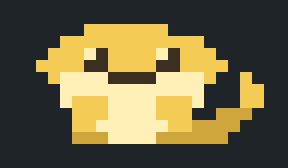
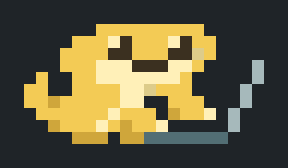
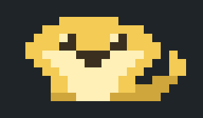

# claude-dotpet

A pixel-art pet that sits above the prompt input in Claude Code's terminal UI, plus a browser-based editor for redrawing it.
The pet changes with the session state, so you can see at a glance whether Claude is still working without reading the transcript.

日本語の説明は [README.ja.md](README.ja.md) にあります。

## When to use

- When you want to see whether Claude is still working, or has finished, from the picture above the prompt rather than from the text.
- When you want to draw your own pet in a browser and apply it with one command, instead of editing source files by hand.
- When you want a ready-made pet: Bun-chan is included as a second art file, and the default sample lizard is meant to be redrawn.

Not for you if you use Claude Code outside the terminal UI, need Windows (untested), or want the in-app messages and the editor UI in a language other than Japanese.

## What it looks like

This is **Bun-chan** (文ちゃん), the author's pet bearded dragon and a member of the family.

| Idle | Working | Done | Sleeping |
|---|---|---|---|
|  |  |  |  |

The pet reflects the session state: **idle**, **working**, **done**, and **sleeping**. The default art is a plain green sample lizard, meant to be redrawn. Bun-chan is included as a second art file (see [Choose the pet](#choose-the-pet)).

## Requirements

- Claude Code, and Node.js 18 or later for the editor's apply command.
- Built on Claude Code's plugin hooks ("mods") API, which is in early access and may change between versions.
- Developed and tested with Claude Code 2.1.288 and 2.1.289 on macOS.
- **Windows is untested.**
- The in-app messages and the editor UI are in Japanese.

## Install

1. Clone this repository.
2. Start Claude Code with the folder as a plugin:

   ```
   claude --plugin-dir /path/to/claude-dotpet
   ```

`--plugin-dir` loads the plugin for that session only. To load it in every session, add it to the `CLAUDE_CODE_PLUGIN_DIRS` environment variable: a `:`-separated list where each entry is either a plugin folder itself or a folder that contains plugin folders (both confirmed in 2.1.292). The variable does not appear in `claude --help`, so treat it as subject to change.

## Commands

| Command | Effect |
|---|---|
| `/dotpet` | Toggle on / off |
| `/dotpet on`, `/dotpet off` | Turn on / off (persists across sessions) |
| `/dotpet big` | Full body, 20 columns × 5 rows of half-block characters (20 × 10 dots) |
| `/dotpet small` | Full body, 10 columns × 3 rows of octant characters (20 × 12 dots) |
| `/dotpet image` | Experimental. Draws the pet as an image, 12 columns × 3 rows |
| `/dotpet still` | Experimental. Single still image, no animation |

Notes:

- `small` uses octant characters (U+1CD00 and above, "Symbols for Legacy Computing Supplement"). The terminal font must include these glyphs (e.g., Cascadia Code); otherwise, the pet displays as empty boxes.
- `image` and `still` require a terminal that supports the kitty graphics protocol. `image` has been confirmed working in kitty and Ghostty; `still` has not yet been tested there. In other terminals, a text fallback is shown; use `big` or `small` instead.
- The pet is not drawn outside the terminal UI, when the band above the input is too short, or while another plugin is drawing in the same band.

## Choose the pet

Two art files are included in `art/pets/`:

| File | Pet | License |
|---|---|---|
| `sample-lizard.json` | Green sample lizard (the default) | MIT |
| `bun-chan.json` | Bun-chan, shown in the GIFs above | CC BY-NC 4.0 |

Switch art using the apply command from the repository folder:

```
node editor/apply_art.js --force art/pets/bun-chan.json
node editor/apply_art.js --force art/pets/sample-lizard.json
```

`--force` is needed because these files are not editor exports and carry no base marker. The command replaces the current art, so export your own drawing first if you want to keep it (previous files are also saved under `backup/`).

## Redraw the pet

1. Open `editor/dotpet_editor.html` in a browser (Chrome was used during development).
2. Pick a size, state, and frame, then paint.
   - `←` and `→` move between frames. Hold the key down to preview the animation.
   - `Shift` + arrow keys shift the picture by one dot. The target can be one picture, one state, or one size.
3. Click 「書き出す」 (export). The browser downloads `dotpet_art_<timestamp>.json`, and the page displays a command.
4. Run that command in a terminal:

   ```
   node "/path/to/claude-dotpet/editor/apply_art.js" ~/Downloads/dotpet_art_<timestamp>.json
   ```

   The command path is determined by the HTML file's location, so it works from any directory. The download location is assumed to be `~/Downloads`; adjust it if your browser saves elsewhere.
5. If the pet does not update in an active session, run `/dotpet` twice or restart the session.

The apply command validates the file, backs up current files to `backup/`, rewrites `art/dotpet_art.json` and the four generated files (`hooks/palette.ts`, `hooks/sit_art.ts`, `hooks/octant_art.ts`, and `editor/dotpet_art.js`), and then runs `claude plugin validate` and `claude plugin test`. If those checks fail, files are restored from the backup. If the `claude` command is not found, the checks are skipped and a notice is printed.

| Option | Effect |
|---|---|
| `--check <file>` | Validate only; write nothing |
| `--regen` | Rebuild the generated files from `art/dotpet_art.json` |
| `--force` | Continue past the two safety stops below (details are still printed) |

Exit codes: 0 on success, 1 on failure, 2 on invalid arguments.

### Safety stops

- **Stale base.** Each export records which version of the art it was based on. If the art has since changed and applying the export would undo any of those changes, the command stops and lists the pictures that would be rolled back along with any pictures changed on both sides. An export that already contains every change in the current art is applied without stopping.
- **Unapplied exports.** If the export directory contains other `dotpet_art*.json` files that were never applied, the command stops and names them. Applied files are recorded in `apply_ledger.json`.

`--force` overwrites the art with the given file, including any rollbacks listed. There is no automatic merge.

## Art format

`art/dotpet_art.json` contains:

- `palette`: nine colors under the fixed keys `A S M E P K B C V`. Color values can be changed; keys cannot be added.
- `big` (20 × 10) and `small` (20 × 12), each with `poses` (the pictures, one string per row, one character per dot, space = transparent) and `order` (which picture each frame shows).

Fixed in this version:

- Frame counts: idle 8, working 48, done 8, sleeping 8. Animation speed is set in `hooks/art.ts`.
- For `small`, every 2 × 4 block of dots may use at most two colors, and transparent counts as one. A terminal cell can only carry a foreground and a background color. The editor outlines offending blocks in red and refuses to export until they are fixed.

## What the plugin reads, writes, runs, and submits

This section lists everything the plugin touches, for review. Nothing leaves the machine.

**In the session (the mod):** it reads the session state that Claude Code passes to its hooks (idle, working, done) and a timer, and draws the pet above the prompt input. It stores two values through Claude Code's plugin store: whether the pet is shown and which size was chosen. It registers one command, `/dotpet`. It does not read the conversation, the prompt text, files, or environment variables, does not run any external command, never calls the model, and never submits or edits a prompt.

**The editor (`editor/dotpet_editor.html`):** a single offline HTML page you open yourself. It makes no network requests and only downloads a JSON file to your browser's download folder.

**The apply script (`editor/apply_art.js`):** a Node.js script you run yourself from a terminal. It reads the JSON you exported, backs up the current art to `backup/` inside the plugin folder, rewrites `art/dotpet_art.json` and the four generated files, and then runs `claude plugin validate` and `claude plugin test` on the plugin folder. It writes only inside the plugin folder and makes no network requests.

## Tests

```
node editor/test_apply_art.js
claude plugin validate .
claude plugin test .
```

## License

- Code and the sample lizard: MIT. See [LICENSE](LICENSE).
- Bun-chan artwork (`art/pets/bun-chan.json` and the GIFs in `assets/`): CC BY-NC 4.0. See [LICENSE-ART.md](LICENSE-ART.md). Credit the author when reusing it; commercial use, such as selling merchandise featuring the artwork, is not permitted. Showing Bun-chan in your own terminal is fine, including on a computer you use for work.

The first draft of the Bun-chan pixel art was created with an AI tool; the author then redrew it by hand in the editor.
